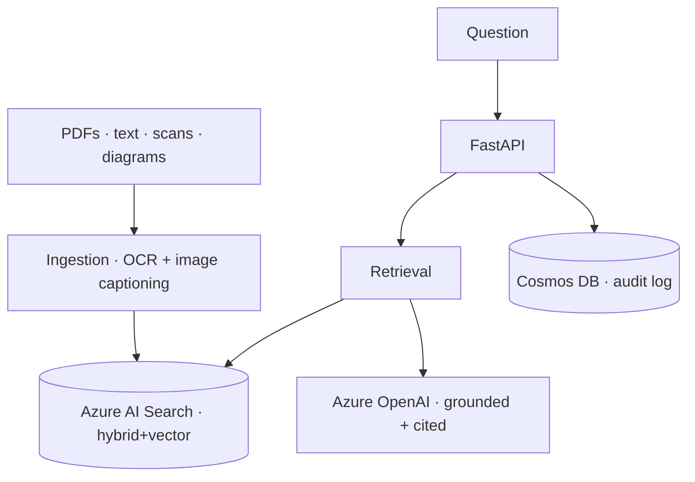

# OCR RAG with Azure Document Intelligence

> An enterprise RAG API that answers questions across large sets of PDFs — including **scanned, handwritten, and diagram-heavy** documents — using OCR and image understanding, and returns grounded answers with page-level citations.

   

## What this project is
A backend that turns a pile of real-world PDFs (not clean text) into a queryable, cited knowledge base. It handles the hard parts plain-text RAG skips: OCR of scans, captioning of embedded diagrams/images, and strict grounding.

## What it actually does (implemented)
- **Hybrid + vector retrieval** (keyword + semantic) over 50+ manuals via Azure AI Search.
- **OCR** of scanned and handwritten pages via Azure Document Intelligence.
- **Image / diagram processing** — embedded figures are captioned and made retrievable.
- **Strict grounding** — returns "I don't know based on the available manuals" when unsupported.
- **Citations** — manual name, page number, and chunk id on every answer.
- **Dual authentication** — API key (POC) or managed identity (enterprise).
- **Audit logging** to Cosmos DB for request traceability.
- **Power Apps / PCF-ready** JSON responses; **Dockerized**.

## Architecture


## Run it
```bash
cp .env.example .env          # Azure OpenAI / AI Search / Doc Intelligence / Cosmos
pip install -r requirements.txt
docker build -t mangos-docintel . && docker run -p 8000:8000 mangos-docintel
```

## Layout
`app/` FastAPI app · `ingestion/` PDF→OCR→caption→index · `frontend/` chat UI · `infra/` deploy notes · `tests/`.

---
